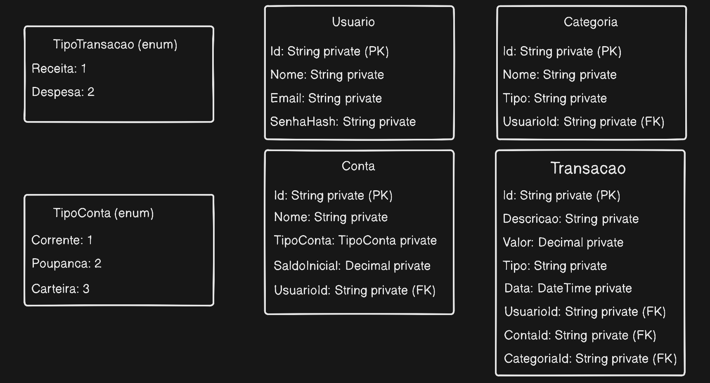

# Gestão Financeira API

Este projeto consiste em uma Web API desenvolvida em C# utilizando ASP.NET, com o objetivo de gerenciar finanças pessoais.

## A aplicação permite o cadastro e gerenciamento de:
Usuários
Contas
Categorias
Transações

## Tecnologias Utilizadas
C#
ASP.NET Web API
Entity Framework Core
SQLite
Swagger

## O projeto foi estruturado em camadas, seguindo o Repository Pattern:
Controllers → recebem requisições HTTP
Services → contêm regras de negócio
Repositories → acesso ao banco de dados
Models (Entities e DTOs) → representação dos dados

## Endpoints
### Usuários
GET /api/users
GET /api/users/{id}
POST /api/users
PUT /api/users/{id}
DELETE /api/users/{id}
### Contas
GET /api/contas
GET /api/contas/{id}
POST /api/contas
PUT /api/contas/{id}
DELETE /api/contas/{id}
### Transações
GET /api/transacoes
GET /api/transacoes/{id}
POST /api/transacoes
PUT /api/transacoes/{id}
DELETE /api/transacoes/{id}
### Categorias
GET /api/categorias
GET /api/categorias/{id}
POST /api/categorias
PUT /api/categorias/{id}
DELETE /api/categorias/{id}

## Modelagem inicial do projeto

